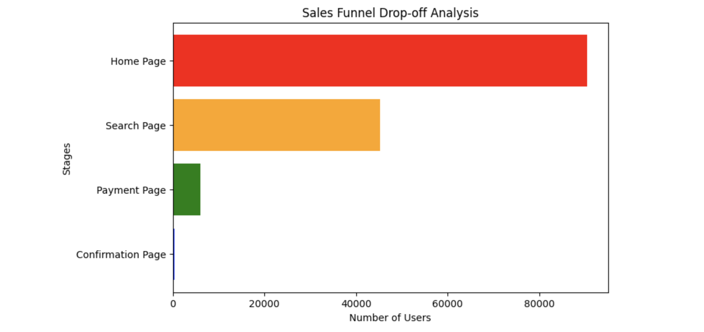

# 📈 Sales Funnel Analysis | Product Analytics Case Study

## Overview

This project analyzes user behavior across a multi-stage sales funnel to identify where potential customers abandon the purchase journey. The objective is to quantify conversion rates, detect high-friction stages, and provide data-driven recommendations to improve overall business performance.

---

## Business Problem

Although thousands of users visit the platform, only a small percentage complete a purchase. Understanding where users leave the funnel helps product and business teams prioritize improvements that can increase conversions and revenue.

---

## Project Objectives

- Analyze user movement through each funnel stage.
- Calculate stage-wise and overall conversion rates.
- Identify the largest customer drop-off points.
- Visualize the complete sales funnel.
- Recommend product improvements based on the findings.

---

## Funnel Stages

Home Page
⬇
Search
⬇
Payment
⬇
Order Confirmation

---

## Key Metrics

| Metric | Value |
|---------|------:|
| Total Visitors | XXXX |
| Overall Conversion Rate | XX% |
| Largest Drop-off Stage | Search → Payment |
| Funnel Completion Rate | XX% |

---

## Key Insights

- Nearly half of all visitors leave before performing a product search, indicating low initial engagement.
- The highest customer loss occurs between the **Search** and **Payment** stages, suggesting users struggle to find suitable products or lose intent before checkout.
- Very few users who reach the payment page complete the transaction, indicating possible friction during checkout.

---

## Business Recommendations

- Simplify the checkout process to reduce payment abandonment.
- Improve search relevance and product discovery.
- Add trust signals such as secure payment badges and customer reviews.
- Introduce cart reminders or promotional offers for users who exit before purchase.
- Perform A/B testing on checkout page layouts to evaluate improvements.

---

## Tech Stack

- Python
- Pandas
- NumPy
- Matplotlib
- Jupyter Notebook

---

## Repository Structure

```
Sales_Funnel_Analysis/
│
├── Sales_Funnel_Analysis.ipynb
├── sales_funnel_chart.png
├── README.md
├── requirements.txt
└── dataset.csv
```

---

## Sample Visualization

<p align="center">

</p>

---

## Future Scope

- Segment users by device, geography, or traffic source.
- Build an interactive Power BI dashboard.
- Measure customer retention across multiple visits.
- Perform cohort analysis.
- Evaluate design changes using A/B testing.

---

## Author

Yug Prabhat
